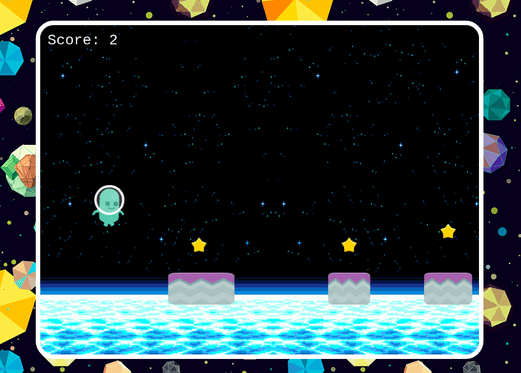

# Platformer Game, Star Collector.

> Collect all the starts you can before falling back to Earth.

Small guy send to orbit with the hard labor of picking up start fragments, get the most of them without falling back to Earth!.

## Built With

- Javascript ES6
- Phaser3
- Webpack
- Babel
- Jest

## Live Demo

[Star Collector](https://starcollector.netlify.app/)

## About the Game

### Mechanics

Enter your name to be recored on the Leader Board.

When you click on the `Play` button, the game starts and you will controll our small hero.

Use the left click button of your mouse to jump one or twice without falling of the platforms.

Collect all the starts you can.

If you loose, Try again!.

### Scenes

- Boot - Preload the assets and starts the "Title" scene.
- Title - Shows the menu,with buttons to Play, Activate or Deactivate the Music, and the Credits.
- Game - The game itself, pick the starts and don't die.
- GameOver - Shows player's score, the Leader Board and a button to return to the main menu..
- Credits - Small animated credits.

### Development Steps

- Think about the game mechanices
- Find assets (Backgrounds, Character Sprites, Buttons, etc)
- Setup the development environment with Phaser 3
- Load assets in the project
- Think about the score system
- Create the title system and game scene with the logic and the physics of the player
- Create the gamover scene
- Connect the score system with the API
- Create the leadboard and connect it with the API

## Getting Started

### Setup & Run

- Clone this repository with: `git clone https://github.com/SigmaSam/Platformer-Game-JS`
- Navigate to the project folder `Platformer-Game-JS`
- Run `npm install`
- Run `npm start`. It will build the project and automatically open your browser in the game page.
- Have fun!
- (Optional) Run `npm run build` to create the `build` folder for deployment.

### Tests

- Run `npm test`

## Potential Features

- Increasing dificulty with the score.
- New Skins for the Character.
- Adding enemies.

## 👤 Author

👤 **Samuel Almao**

- Github: [@SigmaSa](https://github.com/SigmaSam)
- Twitter: [@DungeonSam](twitter.com/dungeonsam)
- Linkedin: [linkedin](https://www.linkedin.com/in/samuel-almao/)

## 🤝 Contributing

Contributions, issues and feature requests are welcome!

Feel free to check the [issues page](https://github.com/SigmaSam/Platformer-Game-JS/issues).

## Show your support

Give a ⭐️ if you like this project!

## Acknowledgments

- Button assets by [Open Game Art](https://opengameart.org/)

## 📝 License

This project is [MIT](LICENSE) licensed.
